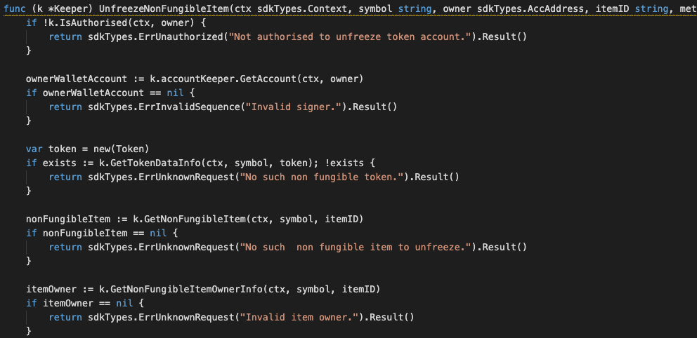

This is the message type used to update the status of an item of a non-fungible token, 
  eg. Freeze or unfreeze

## Parameters

The message type contains the following parameters:

| Name | Type | Required | Description                 |
| ---- | ---- | -------- | --------------------------- |
| owner | string | true   | Item owner| | 
| payload | ItemPayload | true   | Item Payload information| | 
| signatures | []Signature | true   | Array of Signature| | 


#### Item Payload Information
| Name | Type | Required | Description                 |
| ---- | ---- | -------- | --------------------------- |
| item | ItemDetails | true   | Item details information| | 
| pub_key | type/value | true   | crypto.PubKey| | 
| signature | []byte | true   | signature| | 


#### Item Details Information
| Name | Type | Required | Description                 |
| ---- | ---- | -------- | --------------------------- |
| from | string | true   | Item owner| | 
| nonce | string | true   | nonce signature| | 
| status | string | true   | status, eg. freeze or unfreeze | | 
| symbol | string | true   | Token-symbol| | 
| itemID | string | true   | Item ID| | 


#### Example
```
{
  "type": "nonFungible/setNonFungibleItemStatus",
  "value": {
    "owner": "mxw1md4u2zxz2ne5vsf9t4uun7q2k0nc3ly5g22dne",
    "payload": {
      "item": {
        "from": "mxw1f8r0k5p7s85kv7jatwvmpartyy2j0s20y0p0yk",
        "nonce": "0",
        "status": "FREEZE_ITEM",
        "symbol": "TNFT",
        "itemID": "Item-123"
      },
      "pub_key": {
        "type": "tendermint/PubKeySecp256k1",
        "value": "A0VBHXKgUEU2fttqh8Lhqp1G6+GzOxTXvCExzDLEdfD7"
      },
      "signature": "hEnOeX536dduNFgWMOdK0cFKq2xwWW9aAHalW9l5kAgxg94P55MIEQJ8vFkEq9eAcYo1sjQ4TfXW5EynIk/kuQ=="
    },
    "signatures": [
      {
        "pub_key": {
          "type": "tendermint/PubKeySecp256k1",
          "value": "Ausyj7Gas2WkCjUpM8UasCcezXrzTMTRbPHqYx44GzLm"
        },
        "signature": "uDh1fll2eN/3lpKgMydW9mEdgfI3Mint30pkFrrQ+phkIY5X8nMbCoS6WNmw5bqCiVunMhkey75U3Qm99csG4g=="
      }
    ]
  }
}

```

## Handler

The role of the handler is to define what action(s) needs to be taken when this MsgTypeSetNonFungibleItemStatus message is received.

In the file (./x/token/nonfungible/handler.go) start with the following code:


NewHandler is essentially a sub-router that directs messages coming into this module to the proper handler.
Now, you define the actual logic for handling the MsgTypeSetNonFungibleItemStatus-FreezeNonFungibleItem message in handleMsgSetNonFungibleItemStatus:


In this function, requirements need to be met before emitted by the network.  

* A valid Token.
* A valid Item ID which must not be freeze.
* Signer must be authorised.
* Action of Re-freeze-item is not allowed.

Next, you define the actual logic for handling the MsgTypeSetNonFungibleItemStatus-UnfreezeNonFungibleItem message in handleMsgSetNonFungibleItemStatus:




In this function, requirements need to be met before emitted by the network.  

* A valid Token.
* A valid Item ID which must be freeze.
* Signer must be authorised.
* Action of Re-unfreeze-item is not allowed.


## Events

#### 1.
This tutorial describes how to create maxonrow events for scanner base on freeze-item after emitted by a network.

  


#### Usage
This MakeMxwEvents create maxonrow events, by accepting :

* Custom Event Signature : using FrozenNonFungibleItem(string,string,string) 
* Signer
* Event Parameters as below: 

| Name | Type | Description                 |
| ---- | ---- | --------------------------- |
| symbol | string | Token symbol, which must be unique| | 
| owner | string | Signer| | 
| itemID | string | Item ID| | 


#### 2.
This tutorial describes how to create maxonrow events for scanner base on unfreeze-item after emitted by a network.

  


#### Usage
This MakeMxwEvents create maxonrow events, by accepting :

* Custom Event Signature : using UnfreezeNonFungibleItem(string,string,string) 
* Signer
* Event Parameters as below: 

| Name | Type | Description                 |
| ---- | ---- | --------------------------- |
| symbol | string | Token symbol, which must be unique| | 
| owner | string | Signer| | 
| itemID | string | Item ID| | 
